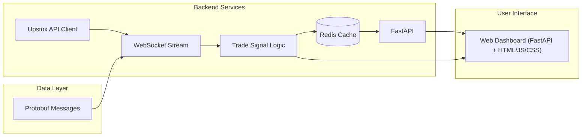

# Stock Alert System

A **real-time stock alert and monitoring system** that streams live market data, detects trading signals, and alerts users through a web dashboard. Built to demonstrate **backend systems, streaming pipelines, and full-stack development** — tailored for finance use cases.

---

## Features

* **Live Market Data Streaming** via WebSockets from Upstox API
* **Signal Detection Engine** for identifying trade opportunities in real-time
* **Redis-Backed Caching Layer** for low-latency data access
* **Protobuf-Based Serialization** (`MarketDataFeed.proto`) for efficient communication
* **Interactive Web Dashboard** with live charts, price updates, and alerts
* **Extensible Architecture** to plug in new strategies (`trade_signal_logic.py`)

---

## System Architecture



---

## Tech Stack

**Languages & Frameworks**

* Python (Flask / FastAPI potential upgrade)
* HTML, CSS, JavaScript (frontend templates)

**Streaming & Data Handling**

* WebSockets for live data
* Protobuf for compact data serialization
* Redis for caching

**Infrastructure**

* Docker (deployment ready)
* Shell scripts (`run.sh`, `build.sh`) for environment setup
---

## Getting Started

### 1. Clone Repository

```bash
git clone https://github.com/yourusername/stock-alert-system.git
cd stock-alert-system
```

### 2. Install Dependencies

```bash
pip install -r requirements.txt
```

### 3. Start Redis

```bash
docker run -p 6379:6379 redis
```

### 4. Run Application

```bash
bash run.sh
```

Open [http://localhost:5000](http://localhost:5000) in your browser.

---

## Future Improvements

* **Multi-user subscriptions** with Kafka/RabbitMQ for horizontal scaling
* **Advanced alerting** (SMS, Email, Push Notifications)
* **ML-driven strategy engine** for predictive signals
* **CI/CD Integration** with GitHub Actions
* **Deployment on Kubernetes** for resilience

---
