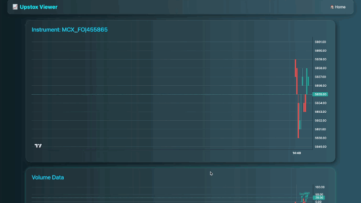

# Stock Alert System

A **real-time stock alert and monitoring system** that streams live market data, detects trading signals, and alerts users through a web dashboard. Built to demonstrate **backend systems, streaming pipelines, and full-stack development** — tailored for finance use cases.

---

## Features

* **Live Market Data Streaming** via WebSockets from Upstox API
* **Signal Detection Engine** for identifying trade opportunities in real-time
* **Redis-Backed Caching Layer** for low-latency data access
* **Protobuf-Based Serialization** (`MarketDataFeed.proto`) for efficient communication
* **Interactive Web Dashboard** with live charts, price updates, and alerts
* **Extensible Architecture** to plug in new strategies (`trade_signal_logic.py`)

---

## System Architecture


---

## Tech Stack

**Languages & Frameworks**

* Python (FastAPI)
* HTML, CSS, JavaScript (frontend templates)

**Streaming & Data Handling**

* WebSockets for live data
* Protobuf for compact data serialization
* Redis for caching

**Infrastructure**

* Shell scripts (`run.sh`, `build.sh`) for environment setup
---

## Getting Started

### 1. Clone Repository

```bash
git clone https://github.com/yourusername/stock-alert-system.git
cd stock-alert-system
```

### 2. Install Dependencies

```bash
pip install -r requirements.txt
```

### 3. Start Redis

```bash
docker run -p 6379:6379 redis
```

### 4. Run Application

```bash
bash run.sh
```

Open [http://localhost:5000](http://localhost:5000) in your browser.

> NOTE: Before running the application, make sure to have an upstox access token, follow the guide [here](https://upstox.com/developer/api-documentation/authentication) to get one. After obtaining the access token, save the token in a variable called `UPSTOX_ACCESS_TOKEN` in your `.env` file.

---

## Future Improvements

* **Multi-user subscriptions** with Kafka/RabbitMQ for horizontal scaling
* **Advanced alerting** (SMS, Email, Push Notifications)
* **Strategy engine** for creating strategies to predict signals
* **Deployment on Kubernetes** for resilience
* **Add unit testing** to ensure proper working of system

---

## Screenshots of the app

### Live streaming data
