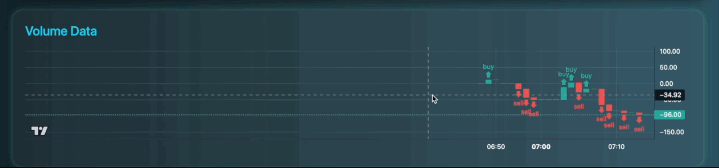

# Stock Alert System

The **Stock Alert System** is a full-stack, real-time trading platform that streams live market data, processes it with **WebSockets + Protobuf**, caches it in **Redis** for low-latency access, and serves **instant trade alerts** through a **FastAPI-powered backend** and interactive web dashboard. Designed with a modular signal engine, the system demonstrates **scalable backend architecture, efficient data streaming, and full-stack integration** — built to model real-world financial trading systems like [TradingView](https://in.tradingview.com/pricing/).

---

## Features

* **Live Market Data Streaming** via WebSockets from Upstox API
* **Signal Detection Engine** for identifying trade opportunities in real-time
* **Redis-Backed Caching Layer** for low-latency data access
* **Protobuf-Based Serialization** (`MarketDataFeed.proto`) for efficient communication
* **Interactive Web Dashboard** with live charts, price updates, and alerts
* **Extensible Architecture** to plug in new strategies (`trade_signal_logic.py`)

---

## System Architecture


---

## Detailed Project Overview

The **Stock Alert System** is built as a full-stack, real-time data pipeline with a modular backend and interactive frontend. Here’s how each piece works together:

### Backend (Data Ingestion & Processing)

1. **Data Source (Upstox API)**

   * Market data (price ticks, order book updates, volumes) is streamed in real-time using the Upstox WebSocket API.
   * A dedicated module `upstox_api.py` handles authentication and connectivity.

2. **WebSocket Stream Handler (`websocket_stream.py`)**

   * Subscribes to the live market feed from Upstox.
   * Normalizes the incoming messages into a standard format.
   * Encodes them using **Protocol Buffers (Protobuf)** defined in `MarketDataFeed.proto` for efficient serialization.
   * Protobuf ensures data is compact and faster to parse compared to JSON, which is critical in real-time trading environments.

3. **Redis Caching Layer (`redis.py`)**

   * All processed tick data is stored in Redis for **low-latency retrieval**.
   * Redis acts as a central cache so multiple backend services (routes, strategy engine, etc.) can access the same live data without re-fetching from the API.
   * This improves performance and fault-tolerance.

4. **Signal Detection Engine (`trade_signal_logic.py`)**

   * Implements trading logic for generating buy/sell/hold alerts based on streaming market data.
   * Currently rule-based (e.g., price thresholds, moving averages) but designed to be **extensible** for advanced strategies (e.g., ML models, technical indicators).
   * Signals are pushed back into Redis and exposed to the frontend through WebSocket updates.

5. **Backend API & Routes (`routes.py`)**

   * Built using **FastAPI** for high-performance HTTP and WebSocket endpoints.
   * Provides REST endpoints for historical queries.
   * Provides WebSocket channels to push new tick data and alerts to the frontend in real-time.

---

### Frontend (User Dashboard)

1. **Templates & Static Files**

   * HTML pages served through FastAPI’s Jinja2 template engine.
   * CSS (`static/css`) and JS (`static/js`) for styling and interactive UI.

2. **Live Data Streaming**

   * JavaScript client (`liveChart.js`) establishes a WebSocket connection to the backend.
   * Subscribes to real-time updates from the Redis-backed backend pipeline.
   * Consumes Protobuf-encoded data, which is decoded into JavaScript objects and plotted on charts.

3. **Interactive Charts & Alerts**

   * **Lightweight charts** by [TradingView](https://tradingview.github.io/lightweight-charts/) update in real-time as new data arrives.
   * Alerts from the backend are rendered as UI notifications, future plans include adding a telegram bot to handle notifications.
   * Users see both **live price ticks** and **triggered trade alerts** in a responsive dashboard.

---

### Data Flow Summary

1. **Upstox API → WebSocket Stream → Protobuf serialization**
2. **Protobuf messages → Redis cache for low-latency storage**
3. **Redis → Signal Engine → Alerts back to Redis**
4. **Frontend WebSocket → Browser JavaScript → Live Charts + Alerts**

---

## Tech Stack

**Languages & Frameworks**

* Python (FastAPI)
* HTML, CSS, JavaScript (frontend templates)

**Streaming & Data Handling**

* WebSockets for live data
* Protobuf for compact data serialization
* Redis for caching

**Infrastructure**

* Shell scripts (`run.sh`, `build.sh`) for environment setup
---

## Getting Started

### 1. Clone Repository

```bash
git clone https://github.com/ArjunXvarma/stock-alert-system.git
cd stock-alert-system
```

### 2. Install Dependencies

```bash
pip install -r requirements.txt
```

### 3. Start Redis

```bash
docker run -p 6379:6379 redis
```

### 4. Run Application

```bash
bash run.sh
```

Open [http://localhost:5000](http://localhost:5000) in your browser.

> NOTE: Before running the application, make sure to have an upstox access token, follow the guide [here](https://upstox.com/developer/api-documentation/authentication) to get one. After obtaining the access token, save the token in a variable called `UPSTOX_ACCESS_TOKEN` in your `.env` file.

---

## Future Improvements

* **Multi-user subscriptions** with Kafka/RabbitMQ for horizontal scaling
* **Advanced alerting** (SMS, Email, Push Notifications)
* **Strategy engine** for creating strategies to predict buy/sell signals
* **Deployment on Kubernetes** for resilience
* **Add unit testing** to ensure proper working of system
* **Improve code quality** to further enhance the codebase.
* **Add watchlist tracking** to track multiple stocks.

---

## Screenshots of the app

### Live streaming data


*Live stock data streaming (clip sped up by 15000x)*


*Live volume data streaming (clip sped up by 15000x)*

### Pages

*Index page*

*Historical data page*
